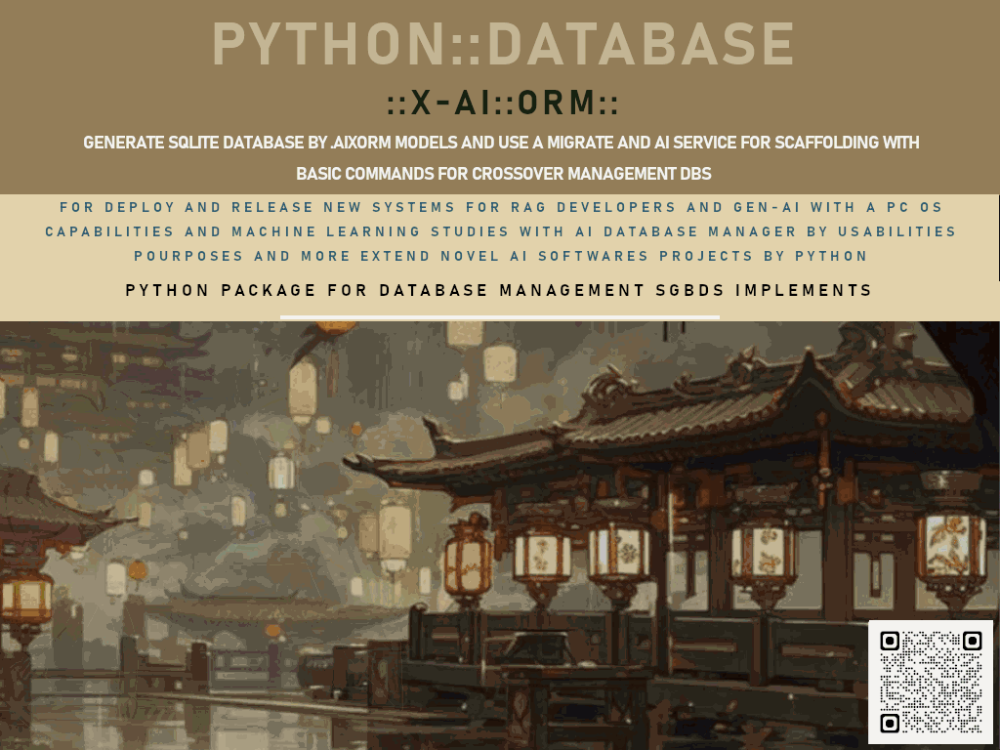

### 🧠 DBXAIORM
ORM Tools for supports severals SGBS and RDBMS with several features like criptografy, migrate, models, data analisys, blob files, migrate and csv for SQLite users.

[])  



**Version:** 4.0 Beta  
**Status:** Under Development  
**Author:** #asytrick  
**Website:** [github.com/ssmool/DBXAIORM](https://github.com/ssmool/DBXAIORM)  
**Contact:** eusmool@gmail.com  

````markdown
### 🧠 DBXAIORM _MANUAL

A powerful, modular, SQLite3-based ORM and database manager built for simplicity, extensibility, and AI integration.

> Developed by [🚀 #asytrick](https://github.com/ssmool)

---

## 📁 Modules

| Module                    | Description                          |
|---------------------------|--------------------------------------|
| `orm`                     | Core ORM functions                   |
| `orm_ai`                  | AI prompt-based table creation       |
| `orm_migrate`             | CSV migration and table viewer       |
| `html_log`                | HTML logging for database operations |
| `criptografy`             | Basic cryptographic utilities        |
| `blob`                    | Blob & Base64 encoding utilities     |
| `analitics`               | Visualization and data analysis      |
| `mock`                    | Data mocking & CSV export            |

---

## 🔧 Installation

Clone the repository:

```bash
git clone https://github.com/ssmool/DBXAIORM.git
cd DBXAIORM
````

> 📌 Ensure you have Python 3.8+ installed.

---

## 🚀 Quick Start

```python
import database_xaiorm.orm as ORM
import database_xaiorm.orm_ai as AI
import database_xaiorm.orm_migrate as MIGRATE
import database_xaiorm.html_log as HTMLOG
import database_xaiorm.criptografy as CRIPTO
import database_xaiorm.blob as BLOB
import database_xaiorm.analitics as ANALYTICS
import database_xaiorm.mock as MOCK
import os
```

---

## 🗃️ Database Lifecycle

### ✅ Create & Operate a Database

```python
def dbop(_dbname):
    ORM.dbcreate(_dbname)
    ORM.dbopen(_dbname)
    ORM.createmodel('tusers','name TEXT NOT NULL,email TEXT NOT NULL UNIQUE,created TIMESTAMP DEFAULT CURRENT_TIMESTAMP')
    ORM.table("tusers", "tusers", action="create")
    ORM.insert("tusers", "name='sa',email='zxxaxzaxsa@sa.com'")
    r = ORM.select("tusers", "email='sa@sa.com'")
    for _r in r:
        print(f'={r}')
    ORM.update("tusers", "name='sa12'", "email='sa@sa.com'")
    ORM.delete("tusers", "email='xsa123@sa.com'")
    ORM.writelog("User added", "INSERT", "tusers")
    ORM.dbclose()
```

---

## 🔄 Migration Tools

```python
def migrate():
    _mock_csv = MOCK.generate_mock_data("val,val_x,val_y,val_z","'v','v',0,0.0",100)
    path_csv = MOCK.save_mock_csv(_mock_csv)
    MIGRATE.view_table_csv_uri(path_csv)
    MIGRATE.save_table_csv_to_database("db_0x01.sqlite3", path_csv, "tusers")
```

---

## 📊 Data Analytics

```python
def analitics():
    ORM.dbopen("db_0x01.sqlite3")
    users = ORM.select("tusers", "name LIKE 'sa'")
    ORM.dbclose()
    for user in users:
        print(user)
    
    ANALYTICS.view_table("db_0x01.sqlite3", "tusers", "email LIKE '%sa.com%'", "email", "name", _type="bar")
    ANALYTICS.view_table_with_query("db_0x01.sqlite3", "SELECT * FROM tusers WHERE name LIKE '%sa%'", 'email', 'name')
```

---

## 📦 Blob Handling

```python
def blob():
    with open('path/to/image.jpg', 'rb') as f:
        binary_data = f.read()
    
    blob_data = BLOB.set_data_blob(binary_data, _buff=1024)
    encoded = BLOB.set_string_64('blob_data')
    decoded = BLOB.get_string_64(encoded)
    
    print(f'Blob={blob_data} | Encoded={encoded} | Decoded={decoded}')
```

---

## 🔐 Cryptography

```python
def cripto():
    key = CRIPTO.GenerateCriptoKey()
    encrypted = CRIPTO.CriptographyContent('content', key)
    decrypted = CRIPTO.Uncripto(encrypted, key)

    print(f'Key: {key}\nEncrypted: {encrypted}\nDecrypted: {decrypted}')
```

---

## 📄 HTML Log Viewer

```python
def log():
    HTMLOG.view_log_html("db_0x01.sqlite3", 'tusers', 'false', filter="email LIKE '%sa.com%'")
```

---

## 🤖 AI Prompt-Based Table Creation

```python
def ai():
    prompt = 'uuid_fk, uuid_fr, product, price, units, saled'
    AI.create_prompt('db_0x01.sqlite3','_store',prompt)
```

---

## 🧪 Mock Data Generator

```python
def mock():
    data = MOCK.generate_mock_data("val,val_x,val_y,val_z","'v','v',0,0.0",100)
    csv_path = MOCK.save_mock_csv(data)
    return csv_path
```

---

## 🏗️ Initialize from Dictionary

Initialize database using dictionary-style models from a `/dict` folder:

```python
def _startdb(database):
    ORM.dbcreate(database)
    dict_path = os.path.join(os.getcwd(), 'dict')
    for fname in os.listdir(dict_path):
        if fname:
            ORM.dbopen(database)
            table_name = fname.lower()
            ORM.createtable(table_name, fname)
    ORM.dbclose()
```

---

## 📌 Full Usage Example

```python
_startdb('db_0x01.sqlite3')
dbop('db_0x01')
migrate()
analitics()
blob()
cripto()
log()
ai()
```

---

## 📃 License

MIT License

---

## 💡 Author

**[🚀 #asytrick](https://github.com/ssmool) - eusmool@gmail.com** – Building smarter databases with Python 🧠📊

```
